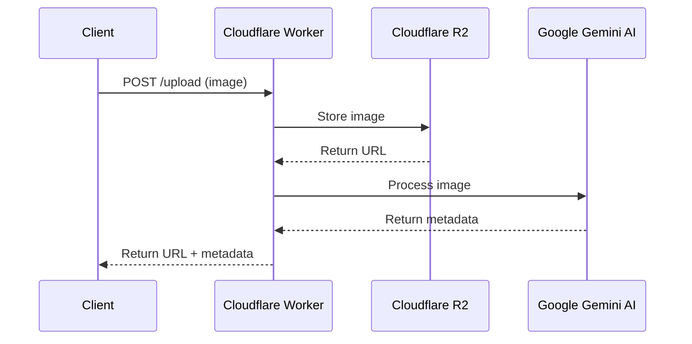

# AEImage - AI-Enhanced Image Processing API

A Cloudflare Worker-based API that processes images using Google's Gemini AI to generate detailed metadata, alt text, and tags.

## 🌟 Features

- Image upload to Cloudflare R2 storage
- AI-powered image analysis using Gemini 1.5
- Automatic generation of:
  - Alt text
  - Detailed descriptions
  - Relevant tags
  - Keywords
- CORS-enabled API endpoints

## 🔧 Setup

1. Clone and install dependencies:
```bash
git clone https://github.com/yourusername/aeimage
cd aeimage
npm install
```

2. Configure environment variables in `wrangler.toml`:
```toml
[vars]
GOOGLE_API_KEY = "your-gemini-api-key"
PUBLIC_URL = "your-public-url"

[[r2_buckets]]
binding = "MY_BUCKET"
bucket_name = "your-bucket-name"
```

3. Run locally:
```bash
npm run dev
```

4. Deploy:
```bash
npm run deploy
```

## 📡 API Usage

### Upload Image
```typescript
const formData = new FormData();
formData.append('file', imageFile);

const response = await fetch('https://your-worker.workers.dev/upload', {
  method: 'POST',
  body: formData
});

const result = await response.json();
// {
//   success: true,
//   url: "https://your-cdn.com/uploads/image.jpg",
//   metadata: {
//     altText: "A red car parked in front of a building",
//     description: "Modern sedan in metallic red...",
//     tags: ["car", "building", "red", "outdoor"],
//     keywords: ["automobile", "architecture", "urban"]
//   }
// }
```

## 🔄 Architecture



## ⚙️ Technical Details

- Built with Hono.js framework
- Uses Cloudflare Workers for edge computing
- Leverages Gemini 1.5 Flash for fast AI processing
- Stores images in Cloudflare R2 (S3-compatible storage)
- TypeScript for type safety

## ❤️ Created by ThisUX

We create beautiful, functional digital experiences that users love. Our expertise includes:
- UX/UI Design
- Web Applications
- Mobile Development
- User-Centered Design Solutions
- AI-Powered Solutions
- SaaS apps

### 💡 Have a Project Idea?

Let's bring your MVP to life! We specialize in turning concepts into polished, production-ready applications.

**Book a Free Consultation:**  
[Schedule 15-min call](https://cal.com/imsanju/15min)

---

## 📝 License

MIT

## 🤝 Contributing

Pull requests are welcome. For major changes, please open an issue first to discuss what you would like to change.
